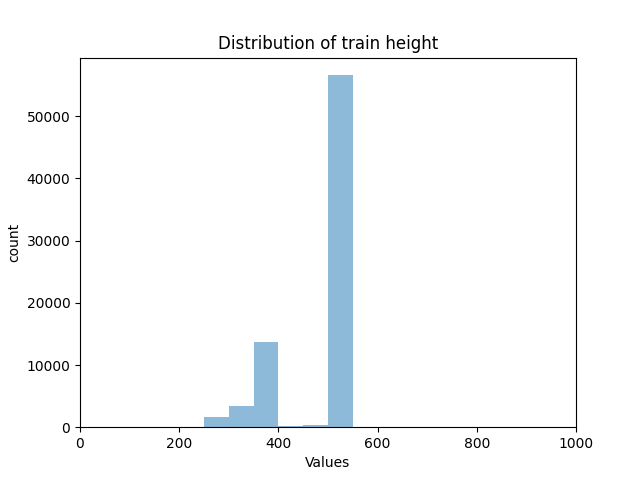

# Food 101 dataset

## Dataset info
Dataset has next structure :

```
{food 101}/
├── train/
│   ├── {class1}/
│   ├── {class2}/
│   ├── ...
└── val/
    ├── {class1}/
    ├── {class2}/
    ├── ...
```

Train dataset consists of 75750 images divided in 101 class
Test dataset consists of 25250 images divided in 101 class

Each class in train dataset has 750 images:


Each class in test dataset has 250 images:


### Width distribution

Width distribution train dataset:


Width distribution test dataset:


### Height distribution

Height distribution train dataset:



Height distribution test dataset:


