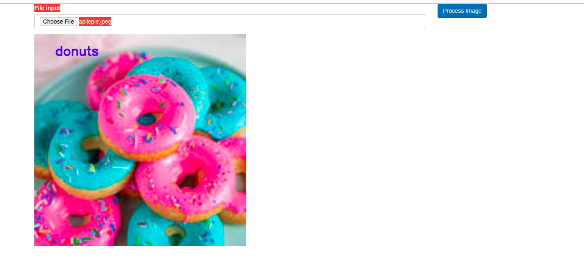

# Pytorch-flask-app

A single page web app which recognizes food.


## Built Using
* Flask (Python) for back-end
* Good ol' Vanilla JS for front-end

## Setup
* Open command line (linux terminal/windows cmd) and cd to microservice directory.
* Run following in command line:
```
docker build -t recognizer .
```
* Then run:
```
docker run -d -p 8080:8080 micro
```
* Wait till you see the message (or any other similar one):
```
 * Running on http://127.0.0.1:8080/ (Press CTRL+C to quit)
 ```
 * By default Flask server listens to port 8080 of localhost. Open [localhost:8080](http://localhost:8080) in your browser.

 Now you can play with the app. 
## Example


