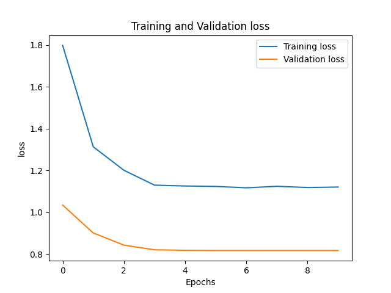

## Food101 - Classification

Model compare 

### Training results

|                     | Accuracy % | Size     | Training Mode |
|---------------------|------------|----------|-----|
| **Resnet18**        | 57.36      | 44.8 MB  |  finetune |
| **Efficientnet b5** | 48.61      | 173.4 MB |  finetune |
| **Swin-s**          | 78.3       | 197.7 MB | finetune |

**Batch size**: 64, 

All models were trained for **10 epochs**;

### Training graphs

**Resnet18:-** 

Finetuning the pretrained resnet18 model.

**Efficientnet_b5:-** 

Finetuning the pretrained efficientnet_b6 model.

**Swin-s:-** 

Finetuning the pretrained swin-s model.

### Todo

1. Experiments with different **learning-rate and optimizers**.
2. Train models from scratch
3. Use label smoothing loss
